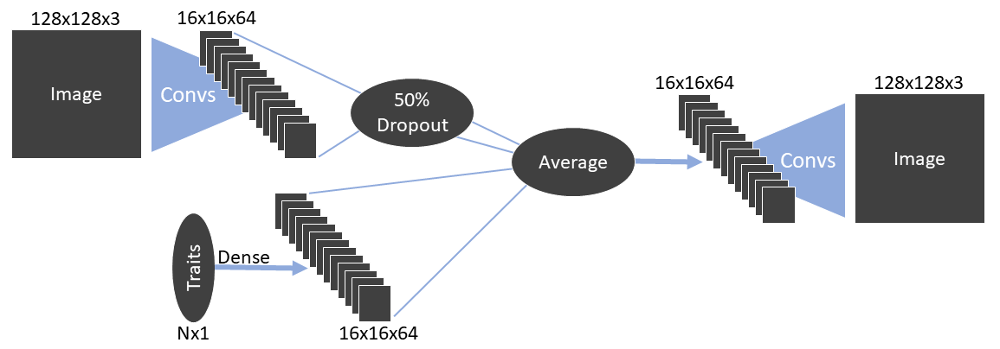
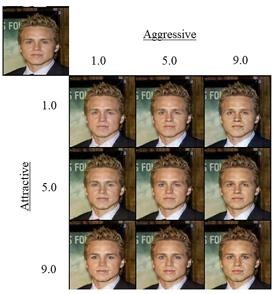
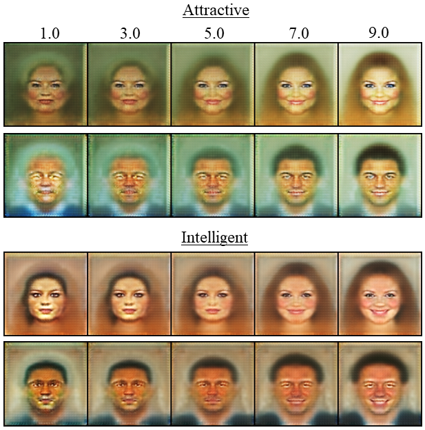

# ModifAE

This repo contains a PyTorch implementation of the ModifAE model from the CogSci 2019 paper "Modifying the Social Dimensions of Faces with ModifAE."

- main.py   allows you to train a ModifAE model.

- generate_images.py  allows you to generate various image modifications and traversals from a trained model.

## Example commands below:

python3 main.py --image_path <img_dir> --data_csv_path <csv_with_img_ratings> --batch_size 400 --input_image_size 128 --log_path <log_dir> --targets trustworthy,aggressive

python3 generate_images.py --log_path <log_dir> --num_traits 2 --first_img_num 087391 --input_image_size 128
